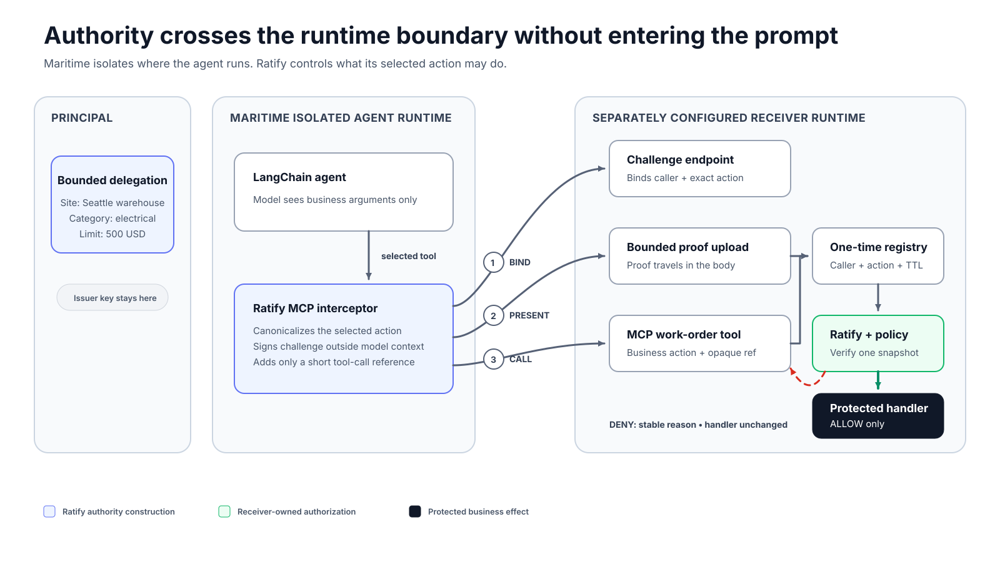
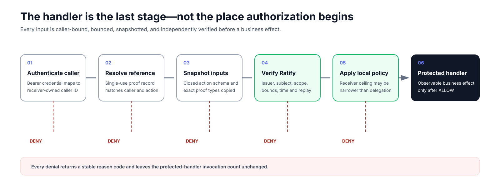

# Ratify Maritime Reference

Planned open reference for an authority-aware LangChain agent running on
Maritime and acting through a public MCP tool interceptor against a separately
deployed Ratify-verifying Streamable HTTP MCP receiver.



The frozen Stage 2 receiver core and Stage 3 transport boundary cover exact
allow, signed bounds, receiver-owned time and policy, revocation, replay,
hostile concurrency, caller ownership, strict proof upload, duplicate and
oversized carriers, real Streamable HTTP MCP discovery and execution, and the
LangChain authority-interceptor seam. Stage 4 now includes a deterministic
LangChain agent runtime and an optional production-model configuration; image
verification now passes locally, while Maritime deployment and the public demo
console remain pending.



Run the current gate:

```bash
uv sync --python 3.12
uv run --python 3.12 pytest
```

The gate requires no model API and includes a real TCP Streamable HTTP flow
through LangChain, the proof interceptor, and the receiver. It holds the agent
identity constant while allowing an in-bounds request and denying an
over-limit request.

## Maritime agent runtime

The root `Dockerfile` is the Maritime GitHub-source build for the agent. It
starts a long-lived server on the injected `PORT` and exposes:

- `GET /health`: side-effect-free readiness
- `POST /chat`: accepts only the enumerated `allow` and `over_limit` demo
  scenarios, requires `Authorization: Bearer <RATIFY_DEMO_TOKEN>`, and applies
  an in-process request limit

The default `RATIFY_MODEL_MODE=deterministic` path exercises the real LangChain
and MCP integration without a paid model. Set `RATIFY_MODEL_MODE=production`
and an explicit `RATIFY_MODEL_ID` to use LangChain's OpenAI-compatible
integration. On Maritime, `OPENAI_API_KEY` and `OPENAI_BASE_URL` can be injected
for its metered model proxy; a provider credential is never used for Ratify
proof construction or receiver authorization.

Copy `.env.example` only as a key-name reference. Private agent material and
the receiver token must be configured through Maritime secrets, never committed
or built into an image. Configure `RATIFY_DEMO_TOKEN` as a separate secret for
the public console; it authenticates access to the demo but grants no Ratify
authority.

The agent and receiver images pin their Python base by digest, include only
runtime source, run as an unprivileged user, and expose container health checks.

## Deployment authority issuance

Create deployment material outside the repository on a trusted principal
machine. The command writes separate principal, receiver, agent, and
secret-free manifest artifacts with restrictive permissions:

```bash
uv run --python 3.12 python scripts/issue_demo_authority.py issue \
  /secure/path/maritime-demo-issuance
```

The delegation is valid for seven days. Renew it on day five without changing
the configured root or agent identity:

```bash
uv run --python 3.12 python scripts/issue_demo_authority.py renew \
  /secure/path/maritime-demo-issuance/principal.json \
  /secure/path/maritime-demo-renewal
```

Only `receiver.env` is imported into the receiver runtime and only `agent.env`
is imported into the agent runtime. `principal.json` must remain outside
Maritime and must never be committed, uploaded, or copied into either runtime.
Renewal emits only a replacement `RATIFY_DELEGATION` and a new public manifest.

## Proof carrier

The model-visible MCP tool contains only the six business arguments shown in
the architecture. The LangChain interceptor obtains a challenge, uploads the
canonical Ratify proof through a body capped before decoding, receives a short
single-use reference, and adds only that reference to the selected MCP call.

The current hybrid proof is approximately 18 KB. Carrying it directly in an
HTTP header would be brittle across ingress and proxy limits, so this reference
does not do that. The opaque reference is bound to authenticated caller,
Ratify subject, exact canonical action, and a short TTL, and is consumed once.

The frozen build requirements are in
[`docs/REFERENCE-REQUIREMENTS.md`](docs/REFERENCE-REQUIREMENTS.md).

Planned deployment:

- `apps/agent/`: LangChain agent runtime built by the root `Dockerfile`
- `apps/receiver/`: Ratify-verifying MCP receiver in a second isolated runtime
- `apps/demo-console/`: standalone Ratify-branded UI deployed independently at
  `labs.ratifyprotocol.com/maritime`
